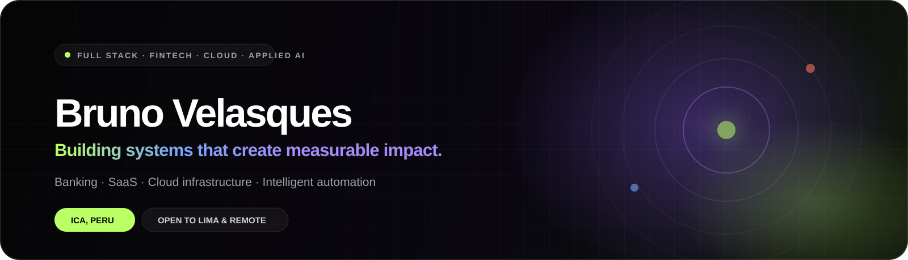

`Full Stack Development` · `Fintech` · `Cloud Architecture` · `Applied AI`

## Hola, soy Bruno 👋

Desarrollador de software **Full Stack** con más de 3 años construyendo soluciones end-to-end para banca, SaaS y productos digitales. Trabajo desde la arquitectura y el backend hasta la experiencia de usuario, con especial atención a la seguridad, la escalabilidad y el impacto que llega a producción.

*Full Stack software developer building end-to-end products for banking, SaaS, cloud infrastructure, and applied AI.*

Actualmente desarrollo productos financieros en **Caja Ica**, colaboro como **consultor IT** en arquitectura SaaS e infraestructura cloud y lidero técnicamente **EDU-MENTOR**, una plataforma voluntaria de empleabilidad juvenil.

## Impacto en producción

<table>
  <tr>
    <td align="center"><strong>10K+</strong> clientes en productos financieros</td>
    <td align="center"><strong>90%</strong> de solicitudes automatizadas</td>
    <td align="center"><strong>40–50%</strong> menos costos operativos</td>
    <td align="center"><strong>30%</strong> menos visitas presenciales</td>
  </tr>
</table>

## En qué estoy trabajando

- 🏦 **Caja Ica — Full Stack Software Developer:** microservicios con Java 17 y Spring Boot, experiencias Angular y productos bancarios protegidos con JWT, RSA y OTP.
- 🧭 **EDU-MENTOR — Volunteer Tech Lead:** monolito modular con NestJS, Prisma y PostgreSQL; hoja de ruta técnica de 14 hitos y estrategia de despliegue.
- ☁️ **ECA Soluciones Empresariales — IT Consultant:** plataforma SaaS multi-tenant, automatización operativa e infraestructura con Docker, Nginx, Redis y BullMQ.

## Stack principal

**Backend & Architecture**

**Frontend & Product**

**Data, Cloud & Delivery**

## Proyectos destacados

| Proyecto | Qué resuelve | Stack principal |
| --- | --- | --- |
| [**ProofPath**](https://github.com/DazzleEaglePe/proofpath) | Credenciales verificables con emisión por lotes y árboles de Merkle en Arbitrum. Proyecto desarrollado para ETH Lima 2026. | NestJS · Solidity · Arbitrum · SwiftUI |
| [**EDU-MENTOR**](https://github.com/DazzleEaglePe/edu-mentor) | Plataforma de empleabilidad juvenil con arquitectura modular, modelo de datos y API REST. | NestJS · Prisma · PostgreSQL · Docker |
| [**Banking Multi-Agent**](https://github.com/DazzleEaglePe/banking-multiagent-langgraph) | Orquestación conversacional para flujos financieros, simulación de créditos y validación de políticas. | LangGraph · Python · FastAPI · Docker |
| [**Azure Search + OpenAI RAG**](https://github.com/DazzleEaglePe/azure-search-openai-rag) | Búsqueda híbrida y recuperación semántica sobre documentación empresarial. | Azure AI Search · Azure OpenAI · Python |
| [**ECA Monitor**](https://github.com/DazzleEaglePe/audit-dashboard-remote-desktop) | Auditoría en tiempo real de sesiones RDP, telemetría y eventos de seguridad. | Next.js · Socket.io · C# · Windows API |
| [**Portfolio 2026**](https://github.com/DazzleEaglePe/portfolio-bruno-velasques) | Portafolio bilingüe con experiencia interactiva, proyectos y diseño responsive. | Next.js · React · TypeScript · Framer Motion |

## Principios de ingeniería

- Arquitecturas mantenibles: **Clean Architecture, SOLID y diseño modular**.
- Calidad integrada al flujo: **JUnit, Mockito, Jasmine, Karma y code review**.
- Seguridad desde el diseño: **JWT, OAuth, RSA, OTP, roles y permisos granulares**.
- Entrega real: contenedores, CI/CD, observabilidad, documentación técnica y despliegues cloud.
- Tecnología conectada con resultados de negocio, no utilizada únicamente por tendencia.

## Formación y comunidad

- 🎓 **Ingeniería de Sistemas**, Universidad Privada San Juan Bautista — egresado, bachiller en trámite.
- ☕ **Java 17 Back-End Developer**, CIBERTEC.
- ✅ **Scrum Foundation Professional Certification**, CertiProf.
- 👥 Miembro activo de **Google Developer Groups Ica**.
- ⛓️ Participante de **ETH Lima 2026**, track Arbitrum.
- 🗣️ Español nativo · Inglés intermedio · Quechua intermedio.

## Conectemos

Estoy abierto a oportunidades de desarrollo Full Stack, backend, fintech, cloud e inteligencia artificial aplicada, con disponibilidad para Lima y trabajo remoto.

- 🌐 [brunovelasques.dev](https://www.brunovelasques.dev/)
- 💼 [LinkedIn](https://www.linkedin.com/in/bruno-velasques-software-developer/)
- ✉️ [brunoty000@gmail.com](mailto:brunoty000@gmail.com)

  Diseño productos que funcionan, escalan y generan impacto medible.

